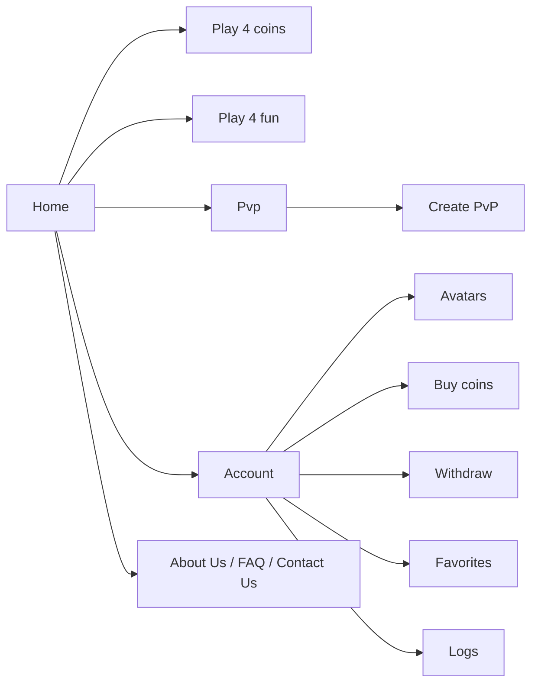

# WinGamer


Frontend for WinGamer, a gaming platform with a virtual coin economy: a landing page, PvP battles, a casual "Play 4 fun" mode, and an account area for managing coins, avatars, favorites and activity logs.

> [!NOTE]
> This repository is the frontend I delivered as a freelancer, from a design provided by the client — a student's project, markup and interaction only. No backend was part of the brief: everything shown (balances, logs, PvP matches) is mock data, and the account/PvP flows aren't wired to any API.

## Pages



## Key decisions

- **Mock data shaped like the real thing** ([src/helpers/](src/helpers)) — activity logs, avatar lists and nav links are static arrays built to match what a real API response would look like (`{ time, action, amount }` for logs, etc.), so wiring up a real backend later means swapping the data source, not restructuring the components.
- **UI state in Redux Toolkit, one slice per concern** ([src/redux/](src/redux)) — `menu`, `modal`, `search`, `color`, `avatar`, `page` and `account-page` are separate slices. None of this is server state (there's no API), it's global UI state (open menus, selected theme color, active account tab) that many unrelated components need to read.
- **Selectable accent color via a `color` slice** ([src/redux/color/slice.ts](src/redux/color/slice.ts)) — the active theme color (`blue` by default) lives in Redux rather than CSS variables alone, so components can react to it in JS, not just via stylesheet.
- **`components/` vs `page-components/` vs `pages/`** — reusable primitives (Button, Input, Card, Modal, Tabs...) are separate from page-specific composed sections (`Intro/Main`, `Intro/Pvp`, `Intro/Coin`, `Intro/Fun`), which are themselves separate from the routed pages that assemble them.

## Stack

| Layer | Technology | Role in this project |
|---|---|---|
| Framework | Create React App, React 18 | SPA shell, routing via `react-router-dom` |
| Language | TypeScript | Typed components, redux state and mock data |
| State | Redux Toolkit | UI-only global state (menu, modal, theme color, account tabs) |
| Styling | Sass (`.module.scss`), `clsx` | Per-component scoped styles |
| Notifications | react-toastify | Toast messages |
| Icons/SVG | react-svg | SVGs imported as components |

`axios` and `js-cookie` are listed in `package.json` but not used anywhere in the code — added ahead of an API/auth integration that was never part of this brief.

## Run locally

```bash
git clone <repo-url>
cd wingamer-frontend
npm install
npm start
```

Open [http://localhost:3000](http://localhost:3000). No environment variables are required — there is no backend or external API to configure.

<details>
<summary>Other scripts</summary>

| Script | What it does |
|---|---|
| `npm start` | Starts the dev server |
| `npm run build` | Production build |
| `npm test` | Runs the CRA test runner (no tests are currently written) |

</details>

## Project structure

```
.
├── src/pages/            # Routed pages: Home, Coins, Fun, Pvp, CreatePvp, Account/*, AboutUs, FAQ, ContactUs, legal pages
├── src/page-components/  # Composed, page-specific sections (Intro/Main, Intro/Pvp, Intro/Coin, Intro/Fun, Card, Section)
├── src/components/       # Reusable UI primitives (Button, Input, Card, Modal, Tabs, Search, Menu, Language, ...)
├── src/layout/           # Header, Footer
├── src/redux/            # Redux Toolkit slices + selectors (page, color, accountPage, avatar, search, menu, modal)
├── src/helpers/          # Static mock data (logs, avatars, nav links)
└── src/types/            # Shared TypeScript types
```

## Tests and status

There are no automated tests. This repo is a frontend snapshot delivered at the end of the engagement — it reflects the state at handoff, not an actively developed product.

## License

No license file is included. There was no written contract for this engagement — it was an informal freelance job. The code is shown here for portfolio purposes.
